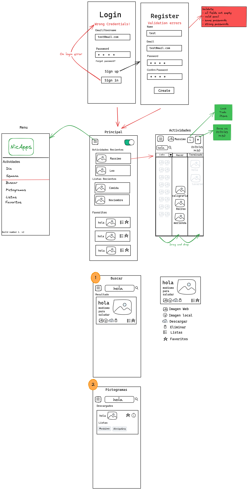

### Summary

The mockups of the App

##### Author: Nicolai ({nicoliniyo})
##### Created: 11/2023   /  Last updated: 11/2023

### Objective

Create the mockup of the app, the screens, identify the functions needed,

### Background

Flutter app needs the mockups to keep design consistent in terms of features, screen and widgets.

#### Glossary

Flutter project needs, to organize, app screens development, tasks to create in backlog, detailed features and screens to understand the full app design.

### Overview

Overview of the design or discussion.

#### Non-goals

App Theme is not required yet, we need to focus on MVP.

### Detailed Design/Discussion

Design Mockups of Screens,, widgets and functions, what is supported, what is not yet.

#### Priority 0

* Suport Arasaac PECS
* Support local storage for configuration data/settings
* Support local storage for pecs/image handling
* Support for i18n
* Search Screen
* Activities Screen with local PECS storage

#### Priority 1

* Pictograms Screen
* Principal Screen
* Support for firebase login/sigin
* Login/Signup Screen

  
### Mvp

* Android 9 MVP local apk

### Mockups

### Testing Plan

Provide a description of testing or a link to a testing plan here, if the discussion involves something that can be tested.

### Release to Stores

* Release 0.9 to Google Play Store
* Release 0.9 to Linux Desktop App
* Release 0.9 to Windows Desktop
* Release 0.9 to Apple Store

[Enlace al documento original]: https://nicoliniyo.github.com/nicoliniyo

